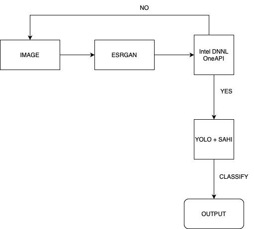

# Vindhler: Vandalism Detection System

## Overview

Vindhler is a comprehensive solution designed to monitor CCTV camera feeds in real time. By leveraging advanced technologies, this system enhances image quality, detects vandalism, and promptly alerts security personnel. The architecture integrates various tools and libraries to create a robust and effective monitoring solution.

## Features

- **Real-Time Monitoring**: Continuously analyzes video feeds from CCTV cameras.
- **Image Enhancement**: Utilizes ESRGAN (Enhanced Super Resolution Generative Adversarial Networks) for improving image quality before processing.
- **Vandalism Detection**: Combines initial detection using Intel's oneDNN and final classification with YOLOv8 to identify spitting and graffiti incidents.
- **User Alerts**: Automatically records incidents and notifies security personnel of suspicious activities.
- **Custom Dataset Creation**: Uses BeautifulSoup and base64 for web scraping to build datasets for training on specific vandalism types.

## System Workflow

The following diagram illustrates the workflow of our Vandalism Detection System:



## Technologies Used

- **Image Enhancement**: [ESRGAN](https://github.com/xinntao/ESRGAN)
- **Web Framework**: [Streamlit](https://streamlit.io/) for frontend and machine learning integration.
- **Data Collection**: Web scraping with [BeautifulSoup](https://www.crummy.com/software/BeautifulSoup/bs4/doc/) and base64 encoding to generate custom datasets.
- **Database Management**: [SQLite](https://www.sqlite.org/index.html) for user data storage and management.
- **Initial Detection**: [oneDNN](https://oneapi.io/learn/oneapi-dnn) from Intel oneAPI Toolkit.
- **Final Classification**: [YOLOv8](https://github.com/ultralytics/yolov8) for detecting and classifying vandalism types.

## OneDNN by Intel OneAPI Toolkit
[OneDNN](https://github.com/oneapi-src/oneDNN) (formerly known as MKL-DNN) is a performance library designed to accelerate deep learning workloads across a variety of hardware architectures, including CPUs, GPUs, and accelerators. Leveraging the advanced capabilities of Intel's hardware, OneDNN provides optimized implementations of common deep learning operations such as convolutions, pooling, and activation functions. In our project, we utilized OneDNN for the initial detection of vandalism, benefiting from its high performance and efficiency. This allows our system to quickly process video feeds, enhancing real-time monitoring capabilities, and enabling immediate recording when suspicious activities are detected.

## Demo Video


## Installation

### Prerequisites

Ensure you have Python 3.x installed on your system. You can check your Python version using:

```bash
python --version
```

### Setup

1. Clone the repository:

   ```bash
   git clone https://github.com/Arr0w28/Off_VandalVision.git
   cd Off_VandalVision
   ```

2. Install the required dependencies:

   ```bash
   pip install -r requirements.txt
   ```

3. Download the pre-trained models for YOLOv8 and ESRGAN, and place them in the `models/` directory.

## Usage

1. Run the Streamlit app:

   ```bash
   streamlit run app.py
   ```

2. Access the application in your web browser at `http://localhost:8501`.

3. Configure the CCTV feed and settings as per your requirements.

4. Monitor the real-time alerts and recordings.

## Contributing

Contributions are welcome! If you have suggestions for improvements or new features, feel free to open an issue or submit a pull request.

## License

This project is licensed under the MIT License. See the [LICENSE](LICENSE) file for more details.
